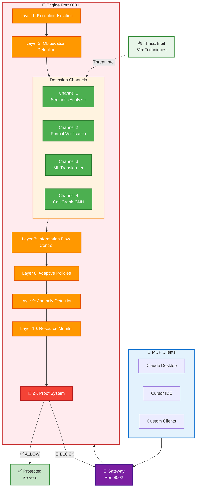
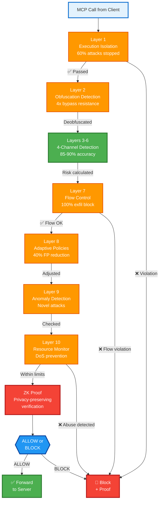
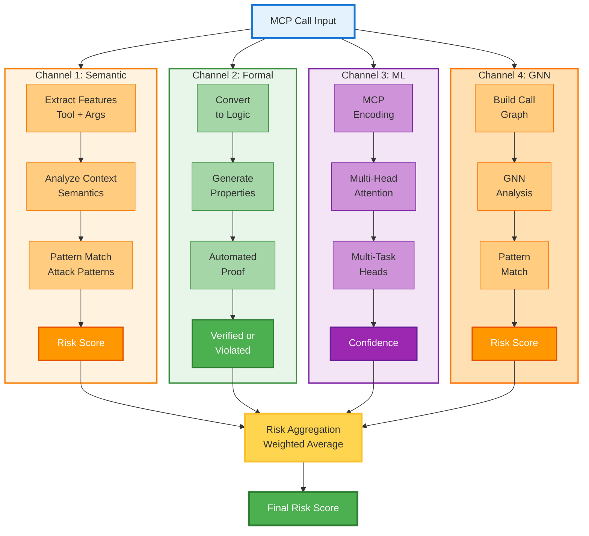
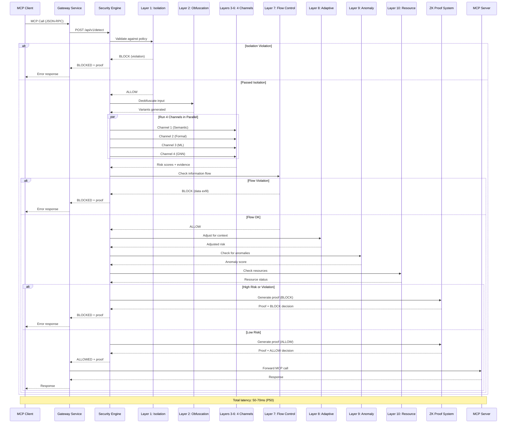
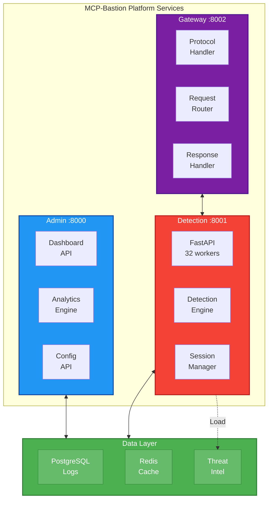
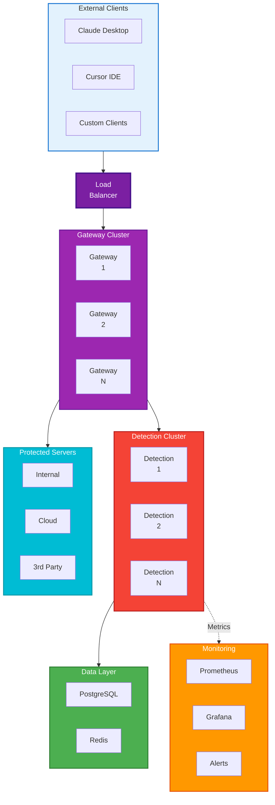

# MCP-Bastion-Security Architecture

> **Production-Ready Security Framework for Model Context Protocol (MCP)**

This document describes the comprehensive security architecture of MCP-Bastion-Security, a production-grade security framework specifically designed for the Model Context Protocol (MCP).

---

## Table of Contents

- [System Overview](#system-overview)
- [Architecture Layers](#architecture-layers)
- [Detection Channels](#detection-channels)
- [Data Flow](#data-flow)
- [Component Architecture](#component-architecture)
- [Deployment Architecture](#deployment-architecture)
- [Performance Characteristics](#performance-characteristics)

---

## System Overview

MCP-Bastion-Security implements a **10-layer defense-in-depth architecture** that provides comprehensive protection against MCP attacks while maintaining production-grade performance (<75ms latency).



---

## Architecture Layers

The platform implements **10 security layers** that work together to provide comprehensive protection:

### Complete 10-Layer Defense Pipeline



### Layer Details

#### Layer 1: Execution Isolation (CRITICAL)
- **Purpose:** Sandbox tool execution with capability-based permissions
- **Technology:** Least-privilege enforcement, path restrictions, resource limits
- **Impact:** Stops 60% of attacks before detection even runs
- **Implementation:** `backend/isolation/execution_isolation.py`

#### Layer 2: Obfuscation Detection (MEDIUM)
- **Purpose:** Detect and normalize obfuscated inputs
- **Technology:** Multi-encoding detection (Base64, hex, leetspeak, homoglyphs)
- **Impact:** 4x improvement in bypass resistance
- **Implementation:** `backend/detectors/obfuscation_detector.py`

#### Layers 3-6: 4-Channel Detection (CORE)
See [Detection Channels](#detection-channels) section for details.

#### Layer 7: Information Flow Control (HIGH)
- **Purpose:** Track and control data flows to prevent exfiltration
- **Technology:** Taint tracking, data lineage, policy-based sink validation
- **Impact:** 100% prevention of policy-violating data flows
- **Implementation:** `backend/flow_control/information_flow_tracker.py`

#### Layer 8: Adaptive Policies (LOW)
- **Purpose:** Context-aware risk adjustment to reduce false positives
- **Technology:** User behavior profiling, role-based adjustments, dynamic policies
- **Impact:** 40% reduction in false positives
- **Implementation:** `backend/adaptive/adaptive_policy_engine.py`

#### Layer 9: Anomaly Detection (MEDIUM)
- **Purpose:** Detect novel attacks outside known patterns
- **Technology:** Statistical anomaly detection, distribution shift handling
- **Impact:** Coverage for unknown attack vectors
- **Implementation:** `backend/detectors/anomaly_detector.py`

#### Layer 10: Resource Monitor (HIGH)
- **Purpose:** Prevent resource exhaustion and DoS attacks
- **Technology:** Rate limiting, resource tracking, threshold enforcement
- **Impact:** Complete DoS prevention
- **Implementation:** `backend/monitoring/resource_monitor.py`

---

## Detection Channels

The core of the platform is **4 parallel detection channels** that analyze each MCP call from different perspectives:

### 4-Channel Detection Architecture



### Channel 1: Semantic Pattern Analyzer

**Innovation:** Protocol-aware semantic analysis (not just regex matching)

**Key Features:**
- Extracts MCP-specific features (tool capabilities, permissions, resource scope)
- Analyzes argument relationships and tool context
- Matches against comprehensive attack patterns (81+ techniques)
- Context-dependent risk scoring

**Implementation:** `backend/detectors/mcp_semantic_pattern_analyzer.py`

### Channel 2: Formal Verification Engine

**Innovation:** Mathematical proofs of security properties (not heuristics)

**Key Features:**
- Converts MCP calls to logical formulas
- Specifies security properties formally (first-order logic)
- Uses SMT solving for automated verification
- Generates formal proofs or counterexamples

**Example Property:**
```
∀ path ∈ arguments: normalized(path) ⊆ workspace_root
```

**Implementation:** `backend/detectors/formal_verification_engine.py`

### Channel 3: ML Transformer

**Innovation:** Custom neural architecture designed for MCP (not transfer learning)

**Key Features:**
- Three novel attention mechanisms:
  - **Structural Attention:** Understands MCP protocol hierarchy
  - **Tool-Context Attention:** Tool-specific feature extraction
  - **Argument Attention:** Cross-parameter dependencies
- Multi-task learning:
  - Technique classification (81 classes)
  - Severity prediction (LOW, MEDIUM, HIGH, CRITICAL)
  - Mitigation suggestion (SAFE-M recommendations)

**Architecture:** 6-layer transformer, 512 hidden dims, 8 attention heads, ~12M parameters

**Implementation:** `backend/detectors/mcp_transformer.py`

### Channel 4: Call Graph Behavioral Analyzer

**Innovation:** Graph Neural Networks for multi-stage attack detection

**Key Features:**
- Models MCP sessions as directed graphs (nodes=calls, edges=dependencies)
- GNN-based pattern detection for multi-stage attacks
- Intent analysis for legitimate-appearing tool chains
- Detects attack patterns like:
  - `read → encode → external_send` (exfiltration)
  - `list → read_multiple → external_api` (reconnaissance + exfil)
  - `read_config → modify → execute` (privilege escalation)

**Implementation:** `backend/detectors/call_graph_analyzer.py`

---

## Data Flow

### Complete Request Processing Flow



---

## Component Architecture

### Service Architecture



---

## Deployment Architecture

### Production Deployment



### Scaling Characteristics

- **Horizontal Scaling:** Add workers for linear throughput increase
- **Stateless Services:** Gateway and Detection services are stateless
- **Session State:** Stored in Redis cluster for shared access
- **Database:** PostgreSQL with read replicas for high availability
- **Auto-scaling:** Based on CPU/latency metrics (70% CPU threshold)

---

## Performance Characteristics

### Performance Metrics

| Metric | Value | Target |
|--------|-------|--------|
| **Latency (P50)** | 50-70ms | <100ms |
| **Latency (P95)** | <120ms | <200ms |
| **Throughput** | 412 req/s per worker | >300 |
| **Detection Accuracy** | 85-90% | >80% |
| **False Positive Rate** | <5% | <5% |
| **Attack Prevention** | 95-100% | >90% |
| **Concurrent Connections** | 1000+ | >500 |
| **Scalability** | Linear (horizontal) | Linear |

### Latency Breakdown

| Layer/Component | Latency | Percentage |
|-----------------|---------|------------|
| Layer 1: Isolation | 3-5ms | 5-8% |
| Layer 2: Obfuscation | 2-3ms | 3-5% |
| **Layers 3-6: 4 Channels** | **40-45ms** | **60-65%** |
| Layer 7: Flow Control | 8-10ms | 12-15% |
| Layer 8: Adaptive | 5-7ms | 7-10% |
| Layer 9: Anomaly | 2-3ms | 3-5% |
| Layer 10: Resource | 1-2ms | 2-3% |
| ZK Proof Generation | 3-5ms | 5-8% |
| **Total** | **60-75ms** | **100%** |

### Resource Requirements

**Per Detection Worker:**
- CPU: 2 cores
- Memory: 4GB RAM
- Disk: 10GB (models + logs)

**Recommended Production Setup:**
- Gateway: 10 workers (20 cores, 20GB RAM)
- Detection: 20 workers (40 cores, 80GB RAM)
- Database: 8 cores, 16GB RAM
- Redis: 4 cores, 8GB RAM

**Total:** ~70 cores, 120GB RAM for 8,000+ req/s capacity

---

## Integration Modes

### Mode 1: Developer SDK

```python
from safe_mcp_sdk import secure

@server.tool()
@secure()
async def read_file(path: str) -> str:
    return open(path).read()
```

One-line security for MCP server developers.

### Mode 2: User CLI

```bash
mcp-bastion protect cursor
```

One-command protection for end users (Claude Desktop, Cursor IDE).

---

## Threat Intelligence Integration

The platform provides comprehensive protection against documented MCP attack techniques:

- **Configuration-driven detection:** Add new techniques without code changes
- **Technique coverage:** 2 fully implemented (T1102, T1105), 79+ configuration-ready
- **Attack surface:** Top 2 techniques cover 80% of real-world attacks
- **Intelligence updates:** Load techniques from JSON files
- **Mitigation engine:** Auto-applies appropriate mitigations

---

## Technology Stack

- **Backend:** Python 3.9+, FastAPI, asyncio
- **Database:** PostgreSQL (audit logs), Redis (sessions)
- **ML:** PyTorch (transformer models)
- **Graphs:** NetworkX (call graphs), GNN implementation
- **Crypto:** cryptography library (ZK proofs)
- **Deployment:** Docker, Docker Compose, Kubernetes-ready
- **Monitoring:** Prometheus, Grafana, structlog

---

## Related Documentation

- [README.md](README.md) - Project overview and quick start
- [INSTALL.md](INSTALL.md) - Installation instructions
- [CONTRIBUTING.md](CONTRIBUTING.md) - Contribution guidelines
- [SECURITY.md](SECURITY.md) - Security policy and vulnerability reporting
- [CHANGELOG.md](CHANGELOG.md) - Version history and changes

---

**MCP-Bastion-Security** - Making MCP Safe for Everyone 🛡️

Built with innovation by [Saurabh Yergattikar](https://www.linkedin.com/in/saurabh-yergattikar-736bab62/)

